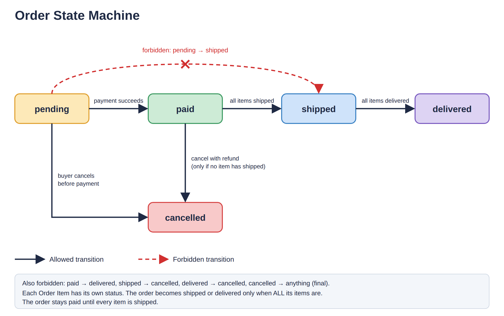

#  API Design and Data Modeling

## Requirements
**What the product does:**
The Fashion Marketplace connects buyers with sellers of fashion products such as clothes, bags, shoes, and accessories. Sellers can list their products with important information such as price, size or dimensions, available colours, stock, and description, while buyers can browse products, add them to their cart, make payment, and place orders.

**Who Uses the Product**
The marketplace will have two main types of users:
- Buyers: Customers who browse and purchase fashion products.
- Sellers: Users who list and manage fashion products and process orders.

**Main Actions**
The main actions in the marketplace are:
1. Seller lists a product with its name, image, category, target audience, price, size or dimensions, colours, stock, description, and material where applicable.
2. Buyer browses and views a product to see its details, price, available colours, size or dimensions, and stock status.
3. Buyer selects an available colour and adds the product to the cart.
4. Buyer places an order and makes payment for the product in the cart.
5. Seller processes the order and marks it as shipped or delivered.
6. Seller restocks a colour when its available stock needs to be increased.

**Product Requirements**
Each product listing should include:
- Product name
- One main product image
- Product category
- Target audience
- Price
- Size or dimensions, depending on the product
- Available colours
- Available stock
- Product description
- Material, where applicable

Each product will have one defined size or dimension. The buyer does not select a size for the product.

A product can have multiple colour options. Buyers can see the colours available for that particular product and select their preferred colour before adding it to their cart.

Stock should be tracked for each available colour. When a particular colour is out of stock, it should no longer be available for selection, while colours that still have stock remain available.

Stock should automatically reduce when an order is placed. Sellers can increase the stock when they restock a colour.

The product should clearly show its price and stock status so buyers know whether it is available before adding it to their cart.

**Reviews**
Buyers can review a product after their order has been delivered.

**Payment**
Payment is part of placing an order. A buyer must complete payment before the order is confirmed.

## Entities
The main entities in the Fashion Marketplace are:

1. User
   Stores account information for buyers and sellers, such as name, email, phone number, password, and role.
   | Field | Type | Required? | Notes |
|---|---|---|---|
| id | UUID | Yes | Generated, not sequential |
| name | String | Yes | User's full name |
| email | String | Yes | Unique |
| phone | String | Yes | User's phone number |
| passwordHash | String | Yes | Stores only the hashed password, never the password itself |
| role | Enum | Yes | Fixed values: `buyer`, `seller` |
| createdAt | Timestamp | Yes | |
| updatedAt | Timestamp | Yes | |

2. Seller
   Stores seller-specific information such as store or brand name and seller details.
   Field| Type| Required?| Notes
id| UUID| yes| generated, not sequential
userId| UUID| yes| Foreign key to User. Must be unique to enforce the 1:1 relationship
storeName| string| yes| Seller's store or brand name
details| string| yes| Seller information
createdAt| timestamp| yes| 
updatedAt| timestamp| yes| 

3. Product
   Represents a fashion product listed by a seller. It includes the product name, image, category, target audience, price, size or dimensions, description, and material where applicable.
   Field| Type| Required?| Notes
id| UUID| yes| generated, not sequential
sellerId| UUID| yes| Foreign key to Seller
name| string| yes| Product name
imageUrl| string| yes| Main product image
category| enum| yes| Fixed values: "bags", "shoes", "clothes", "accessories"
targetAudience| enum| yes| Fixed values: "men", "women", "unisex"
price| integer| yes| Whole number in kobo. Must be greater than 0
currency| string| yes| Currency code, e.g. "NGN"
sizeOrDimensions| string| yes| Size or dimensions depending on the product
description| string| yes| Product description
material| string| no| Material where applicable
deletedAt| timestamp| no| Nullable. Used for soft deletion because old orders may still reference the product
createdAt| timestamp| yes| 
updatedAt| timestamp| yes| 

4. Product Colour
   Stores the available colours for a product and the stock quantity for each colour. A colour is an option under a product, not a separate product.
   Field| Type| Required?| Notes
id| UUID| yes| generated, not sequential
productId| UUID| yes| Foreign key to Product. Together with colour, must be unique
colour| string| yes| Available colour for the product
stockQuantity| integer| yes| Current stock for this colour. Cannot be below 0
createdAt| timestamp| yes| 
updatedAt| timestamp| yes| 


5. Cart
   Represents a buyer's shopping cart.
   Remaining Entity Schema
Field| Type| Required?| Notes
id| UUID| yes| generated, not sequential
userId| UUID| yes| Foreign key to User. Must be unique to enforce one active cart per buyer
createdAt| timestamp| yes| 
updatedAt| timestamp| yes| 


6. Cart Item
   Represents a specific product, selected colour, and quantity added to a cart.
   Field| Type| Required?| Notes
id| UUID| yes| generated, not sequential
cartId| UUID| yes| Foreign key to Cart
productColourId| UUID| yes| Foreign key to Product Colour
quantity| integer| yes| Must be greater than 0
createdAt| timestamp| yes| 
updatedAt| timestamp| yes| 

Constraint: "cartId + productColourId" must be unique so the same colour cannot appear twice in one cart.

7. Order
   Represents a purchase made by a buyer. It stores information such as the buyer, total amount, payment status, order status, and delivery address.
Field| Type| Required?| Notes
id| UUID| yes| generated, not sequential
buyerId| UUID| yes| Foreign key to User
total| integer| yes| Whole number in kobo. Must be greater than 0
currency| string| yes| Currency code, e.g. "NGN"
status| enum| yes| Fixed order status values
deliveryAddress| string| yes| Copy of the buyer's delivery address at order time, so it stays correct if the buyer changes their address later
createdAt| timestamp| yes| 
updatedAt| timestamp| yes| 
| Field | Type | Required? | Notes |
|---|---|---|---|
| status | Enum | Yes | Fixed values: `paid`, `shipped`, `delivered` |

8. Order Item
   Represents each product and selected colour included in an order.
   Field| Type| Required?| Notes
id| UUID| yes| generated, not sequential
orderId| UUID| yes| Foreign key to Order
sellerId| UUID| yes| Foreign key to Seller. Duplicates the seller reachable through Product Colour so a seller can access their own order items quickly, even if the product is later removed
productColourId| UUID| yes| Foreign key to Product Colour. ON DELETE RESTRICT because a colour that appears in an order can never be hard-deleted
productName| string| yes| Copy of the product name at purchase time
colourName| string| yes| Copy of the colour name at purchase time
unitPrice| integer| yes| Product price in kobo at purchase time. Must be 0 or more
quantity| integer| yes| Quantity purchased. Must be greater than 0
createdAt| timestamp| yes| 
updatedAt| timestamp| yes| 

Note: "productName", "colourName", and "unitPrice" are intentionally copied onto the Order Item. This preserves the details of what the buyer purchased even if the product name, colour name, or price changes later.

9. Payment
   Stores payment information related to an order, such as amount, payment status, and payment reference.
   Field| Type| Required?| Notes
id| UUID| yes| generated, not sequential
orderId| UUID| yes| Foreign key to Order
amount| integer| yes| Whole number in kobo. Must be greater than 0
currency| string| yes| Currency code, e.g. "NGN"
status| enum| yes| Fixed payment status values
paymentReference| string| yes| Unique payment reference
createdAt| timestamp| yes| 
updatedAt| timestamp| yes| 


10. Review
    Stores a buyer's review and rating for a product after the order has been delivered.
    Field| Type| Required?| Notes
id| UUID| yes| generated, not sequential
orderItemId| UUID| yes| Foreign key to Order Item. Must be unique
rating| integer| yes| Must be between 1 and 5
comment| string| no| Buyer's review comment
createdAt| timestamp| yes| 
updatedAt| timestamp| yes| 

Constraint: "orderItemId" must be unique so each purchased order item can have only one review.
   

## Relationships
The entities in the Fashion Marketplace are connected as follows:
- User → Seller: 1:1. A user can have one seller profile.
- Seller → Product: 1:N. One seller can list many products.
- Product → Product Colour: 1:N. One product can have multiple colours.
- User → Cart: 1:1. One buyer has one active cart.
- Cart → Cart Item: 1:N. One cart can contain many items.
- Product Colour → Cart Item: 1:N. A product colour can appear in many cart items.
- User → Order: 1:N. One buyer can place many orders.
- Order → Order Item: 1:N. One order can contain many items.
- Seller → Order Item: 1:N. One seller can have many order items. Each order item belongs to one seller, so a seller only sees their own items.
- Product Colour → Order Item: 1:N. A product colour can appear in many order items.
- Order → Payment: 1:N. One order can have multiple payment attempts, such as when a previous payment fails and the buyer retries.
- Order Item → Review: 1:0..1. An order item can have zero or one review. A review must belong to an order item.
- User → Review: via Order Item. A buyer is connected to a review through Review → Order Item → Order → User.

## Hard Questions
Order status


Order statuses are:
- "pending"
- "paid"
- "shipped"
- "delivered"
- "cancelled"

Allowed transitions:
- "pending → paid": payment succeeds.
- "pending → cancelled": buyer cancels before payment.
- "paid → shipped": all Order Items have been shipped.
- "paid → cancelled": allowed with a refund if the order cannot be fulfilled before shipping.
- "shipped → delivered": all Order Items have been delivered.

Forbidden transitions:
- "cancelled → anything": cancelled is a final state.
- "paid → delivered": an order cannot skip the shipped state.
- "pending → shipped": payment must be completed before shipping.
- "paid → pending": an order cannot go back to pending after payment.
- "paid → cancelled": forbidden once any Order Item has shipped, because that item cannot be un-shipped.
- "shipped → cancelled": cancellation is no longer allowed after shipping.
- "delivered → pending": delivered is a final completed state.
- "delivered → cancelled": a delivered order cannot be cancelled.

Each Order Item has its own status because one order can contain products from different sellers. The overall Order becomes "shipped" only when all its Order Items are "shipped", and becomes "delivered" only when all its Order Items are "delivered".

The order stays "paid" until every Order Item is "shipped", even if some items have already been shipped.

Only the seller associated with an Order Item can mark that item as "shipped" or "delivered".

The API updates the Order Item status and the overall Order status in the same database transaction.

Cancelling an order returns each item's quantity to its Product Colour's stock, in the same transaction.

The API checks the current status before allowing a transition, and the database enum prevents invalid status values.

State machine diagram:

"Order State Machine" (docs/order-state-machine.png)

Time

Soft-deleted with "deletedAt":
- User: soft-delete, because orders reference the buyer and deletion requests must still be honoured.
- Seller: soft-delete, so seller records connected to products and order history remain available.
- Product: soft-delete, because old orders may reference the product.
- Product Colour: soft-delete with "deletedAt". "ON DELETE RESTRICT" also prevents hard deletion when the colour is referenced by an Order Item. A seller can also set its stock to "0" when they no longer want it available.

The User, Seller, Product, and Product Colour tables must include a "deletedAt" field:

- "deletedAt": nullable datetime. It is "NULL" when the record is active and set when the record is soft-deleted.

For Product Colour, the "productId + colour" combination must only be unique where "deletedAt" is "NULL", so a seller can re-add a colour after the previous colour was soft-deleted.

Temporary data that can be hard-deleted:
- Cart
- Cart Item

Transaction and history records are retained:
- Order
- Order Item
- Payment
- Review

These records represent completed or attempted transactions and should not be removed as normal product cleanup.

Order Item.sellerId

"OrderItem.sellerId" is copied from the product so a seller can list their own order items fast, even if the product is later removed.s


Constraints and Indexes

Constraints

The following database constraints will be enforced:

Entity| Constraint| Purpose
User| "email" unique| Prevents multiple accounts from using the same email
User| "role" enum: "buyer", "seller"| Prevents invalid user roles
Seller| "userId" unique| Enforces one seller profile per user
Product| "price > 0"| Prevents products from having a zero or negative price
Product| "category" enum: "bags", "shoes", "clothes", "accessories"| Prevents inconsistent category values
Product| "targetAudience" enum: "men", "women", "unisex"| Prevents inconsistent audience values
Product Colour| "productId + colour" unique| Prevents the same colour from being added twice to one product
Product Colour| "stockQuantity >= 0"| Prevents negative stock
Cart| "userId" unique| Enforces one active cart per buyer
Cart Item| "cartId + productColourId" unique| Prevents the same colour from appearing twice in one cart
Cart Item| "quantity > 0"| Prevents zero or negative quantities
Order| "total > 0"| Prevents an order from having a zero or negative total
Order| "status" enum: "pending", "paid", "shipped", "delivered", "cancelled"| Prevents invalid order statuses
Order Item| "quantity > 0"| Prevents zero or negative quantities
Order Item| "unitPrice >= 0"| Prevents negative prices
Order Item| "productColourId" ON DELETE RESTRICT| Prevents a colour that appears in an order from being hard-deleted
Order Item| "status" enum: "pending", "paid", "shipped", "delivered", "cancelled"| Prevents invalid order item statuses
Payment| "amount > 0"| Prevents a zero or negative payment amount
Payment| "status" enum: "pending", "succeeded", "failed"| Prevents invalid payment statuses
Payment| "paymentReference" unique| Prevents duplicate payment references
Review| "orderItemId" unique| Allows only one review per purchased order item
Review| "rating" between 1 and 5| Prevents invalid ratings

The API must also check that an Order Item has status "delivered" before allowing a review to be created.

Indexes

Indexes will be added where they support common queries and are not already created automatically by unique constraints:

Table| Index| Purpose
Product| "sellerId"| Quickly find products belonging to a seller
Product| "(category, targetAudience)"| Supports filtering products by category and target audience
Cart Item| "productColourId"| Quickly find carts containing a specific product colour
Order| "buyerId"| Quickly find orders belonging to a buyer
Order Item| "orderId"| Quickly find items belonging to an order
Order Item| "sellerId"| Quickly find a seller's order items
Order Item| "productColourId"| Quickly find order items for a product colour
Payment| "orderId"| Quickly find payment attempts for an order

Unique constraints already create indexes, so separate indexes are not needed for "Seller.userId", "ProductColour(productId, colour)", "CartItem(cartId, productColourId)", "Payment.paymentReference", or "Review.orderItemId".

Safe Stock Updates

Stock is reduced using one atomic database update that only succeeds when enough stock is available:

"stockQuantity >= quantity"

If two buyers try to purchase the last item at the same time, only the first valid update succeeds. The second update changes nothing, and that buyer receives an out of stock error.

Impossible States

The database constraints and API rules prevent important invalid states:

- A buyer cannot have two carts: "Cart.userId" is unique.
- A colour cannot have negative stock, even if two buyers order the last item at once: "stockQuantity >= 0", and stock is reduced using an atomic update that requires enough stock.
- A review cannot exist twice for one purchase: "Review.orderItemId" is unique.
- A product colour used in an order cannot be hard-deleted: "OrderItem.productColourId" uses "ON DELETE RESTRICT".

Hard Questions

Normalisation

Some information is deliberately copied instead of being read from the current Product record. "Order Item" stores the product name, colour name, unit price, and seller ID at purchase time, while "Order" stores a copy of the delivery address and total at order time. Without these copies, later product, seller, price, or address changes could make an old order show information that was not true when the purchase was made.

"OrderItem.sellerId" is copied so a seller can list their own order items quickly, even if the product is later removed.

Money
All money values are stored as whole numbers in minor units, using kobo for NGN, with a separate currency column. This applies to "Product.price", "Order.total", "OrderItem.unitPrice", and "Payment.amount".

Time
"User" uses soft deletion through "deletedAt" because orders reference the buyer and deletion requests must still be honoured.

"Seller" uses soft deletion through "deletedAt" so seller records connected to products and order history can remain available without removing historical relationships.

"Product" uses soft deletion through "deletedAt" because old orders may still reference the product.

"Product Colour" uses soft deletion through "deletedAt". It also has "ON DELETE RESTRICT" through Order Item, so a colour that has been ordered cannot be hard-deleted. A seller can instead mark it unavailable or set its stock to 0.

Cart, Cart Item, Order, Order Item, Payment, and Review are hard-deleted only where appropriate because they represent temporary cart data or records whose relationships do not require historical preservation in the same way as products and transaction references.

Identifiers
All entity IDs are UUIDs rather than sequential numbers. UUIDs make IDs harder to guess, which reduces the risk of someone discovering other resources by simply changing an ID in a URL or API request.


## API Contracts

**API Conventions**

- All API paths start with "/api/v1".
- Successful responses use:

{
  "data": {},
  "meta": {}
}

- Error responses use:

{
  "error": {
    "code": "...",
    "message": "..."
  }
}

- List endpoints use "limit", "offset", filters, and sort.
- "limit" defaults to "20" and has a maximum of "100".
- If "limit" is greater than "100", the API clamps it to "100".
- All money values are sent and stored in kobo.
- Protected endpoints require authentication.

Idempotency

Product creation and order placement use an idempotency key to prevent duplicate products.

The API stores:

Field| Type| Purpose
userId| UUID| User who made the request
key| string| Idempotency key
requestHash| string| Hash of the request body
storedStatus| integer| Original response status
storedResponse| JSON| Original response body
createdAt| timestamp| When the record was created

There is a unique constraint on "userId + key".

The idempotency record and product are created in one database transaction.

If two identical requests arrive at the same time, the unique "userId + key" constraint prevents both requests from creating the same product. The second request returns "409 REQUEST_IN_PROGRESS", or waits for the first transaction to finish and then returns the stored response.

A retry using the same key and the same request body returns the original response with the same status and body.

The same key with a different request body returns "422 IDEMPOTENCY_KEY_REUSED".

A missing "Idempotency-Key" header returns "400 IDEMPOTENCY_KEY_REQUIRED".

Idempotency records are deleted after 24 hours.

**POST /api/v1/products**
Who can call it: Authenticated sellers only.

Headers:

Header| Required?| Description
"Authorization"| Yes| Login token used to identify the seller
"Idempotency-Key"| Yes| Unique key for this product creation attempt

Request body:

Field| Type| Required?
name| string| Yes
imageUrl| string| Yes
category| enum: "bags", "shoes", "clothes", "accessories"| Yes
targetAudience| enum: "men", "women", "unisex"| Yes
price| integer (kobo)| Yes
currency| "NGN"| Yes
sizeOrDimensions| string| Yes
description| string| Yes
material| string| No
colours| array of objects| Yes

Each colour contains:

Field| Type| Required?
colour| string| Yes
stockQuantity| integer| Yes

A product must have at least one colour. Colour names must be unique within the product.

"sellerId" is taken from the authenticated user's login token and is not accepted in the request body.

Errors:

Status| Code| When
400| "IDEMPOTENCY_KEY_REQUIRED"| "Idempotency-Key" header is missing.
400| "MALFORMED_JSON"| Request body is not valid JSON.
401| "UNAUTHENTICATED"| User is not logged in or token is invalid.
403| "FORBIDDEN"| Logged-in user is not a seller.
409| "REQUEST_IN_PROGRESS"| Another request with the same user and idempotency key is currently being processed.
422| "VALIDATION_ERROR"| A required field is missing or has an invalid value.
422| "IDEMPOTENCY_KEY_REUSED"| Same key was used with a different request body.

Examples of "VALIDATION_ERROR" messages:

"name is required"
"category is invalid"
"targetAudience is invalid"
"currency must be NGN"
"price must be greater than 0"
"colours must contain at least one colour"
"colour names must be unique"
"stockQuantity must be a whole number, 0 or more"

Success response: "201 Created"

The response includes "sellerId", "createdAt", "updatedAt", and calculated "totalStock".

"totalStock" is not stored in the database. It is calculated by adding the stock quantity of all product colours.

Idempotent? Yes.

The API stores the idempotency key, request hash, and original response. A retry with the same key and body returns the original response instead of creating another product.


**GET /api/v1/products**
Who can call it: Public. Buyers do not need to be logged in.

Query parameters:
Parameter| Type| Default| Allowed values
"limit"| integer| "20"| Whole number from "1–100". Values above "100" are clamped to "100".
"offset"| integer| "0"| Whole number "0" or greater
"category"| string| None| "bags", "shoes", "clothes", "accessories"
"targetAudience"| string| None| "men", "women", "unisex"
"minPrice"| integer| None| Whole number "0" or greater, in kobo
"maxPrice"| integer| None| Whole number "0" or greater, in kobo
"sort"| string| "createdAt"| "price", "createdAt"
"order"| string| "desc"| "asc", "desc"

If "limit" is greater than "100", the API clamps it to "100".

If "offset" is beyond the total number of matching products, the API returns "200 OK" with an empty "data" array and "hasMore: false". This is not treated as an error.

Results are always ordered by the chosen sort field, then by "id". This provides a stable tie-break when multiple products have the same price or creation time.

The endpoint returns active products only. Soft-deleted products are excluded.

A product remains listed even when all its colours are out of stock. It is shown as out of stock so buyers can still see the product.

The browse response contains summary information rather than the full product description. The full description is returned by "GET /api/v1/products/:id".

Success response: "200 OK"

{
  "data": [
    {
      "id": "9d7f2a4e-7d3e-4f8a-9f2e-5a6d7c8b9e10",
      "name": "Large Tote Bag",
      "imageUrl": "https://example.com/tote-bag.jpg",
      "category": "bags",
      "targetAudience": "women",
      "price": 8500000,
      "currency": "NGN",
      "sizeOrDimensions": "Large",
      "colours": [
        {
          "colour": "Black",
          "inStock": false
        },
        {
          "colour": "Blue",
          "inStock": true
        },
        {
          "colour": "Green",
          "inStock": true
        }
      ],
      "totalStock": 8
    }
  ],
  "meta": {
    "total": 1,
    "limit": 20,
    "offset": 0,
    "hasMore": false
  }
}

Errors:

Status| Code| When
400| "VALIDATION_ERROR"| A query parameter is missing a valid value or has an invalid value.

Examples:

"limit must be a whole number between 1 and 100"
"offset must be a whole number 0 or greater"
"category is invalid"
"targetAudience is invalid"
"minPrice must be a whole number 0 or greater"
"maxPrice must be a whole number 0 or greater"
"minPrice cannot be greater than maxPrice"
"sort must be price or createdAt"
"order must be asc or desc"

A "limit" above "100" is not an error. It is clamped to "100".

Safe and idempotent? Yes.

GET does not modify product data or application state. Repeating the same request is safe and idempotent for the same underlying data.

**GET /api/v1/products/:id**
Who can call it: Public. Buyers do not need to be logged in.

Path parameter:
Parameter| Type| Required?
"id"| UUID| Yes

Success response: "200 OK"

{
  "data": {
    "id": "9d7f2a4e-7d3e-4f8a-9f2e-5a6d7c8b9e10",
    "sellerId": "7a2b3c4d-5e6f-7a8b-9c10-11d12e13f14a",
    "name": "Large Tote Bag",
    "imageUrl": "https://example.com/tote-bag.jpg",
    "category": "bags",
    "targetAudience": "women",
    "price": 8500000,
    "currency": "NGN",
    "sizeOrDimensions": "Large",
    "description": "Large everyday tote bag.",
    "material": "Leather",
    "colours": [
      {
        "id": "1b2c3d4e-5f6a-7b8c-9d10-11e12f13a14b",
        "colour": "Black",
        "inStock": false
      },
      {
        "id": "2b3c4d5e-6f7a-8b9c-0d11-12e13f14a15b",
        "colour": "Blue",
        "inStock": true
      },
      {
        "id": "3b4c5d6e-7f8a-9b0c-1d12-13e14f15a16b",
        "colour": "Green",
        "inStock": true
      }
    ],
    "totalStock": 8,
    "createdAt": "2026-09-29T10:00:00Z",
    "updatedAt": "2026-09-29T10:00:00Z"
  },
  "meta": {}
}

The public product detail page shows only "inStock", not the exact "stockQuantity" for each colour. This prevents exposing the seller's exact inventory while still telling buyers whether a colour is available.

"totalStock" is shown because the requirements require buyers to see overall stock availability; the exact stock per colour is still hidden.

Errors:

Status| Code| When
400| "VALIDATION_ERROR"| The product ID is not a valid UUID.
404| "NOT_FOUND"| The product does not exist or has been soft-deleted.

Soft-deleted products return "404 NOT_FOUND" through the public API.

Safe and idempotent? Yes.

GET does not modify product data or application state.

Product Availability Decisions
1. Product with all colours out of stock: The product remains listed. Buyers can still view it, but it is shown as out of stock and no colour can be selected for purchase.

2. Exact stock visibility: The public detail page shows only "inStock", not the exact "stockQuantity" for each colour. "totalStock" is still shown because the requirements require overall stock availability.

### POST /api/v1/cart/items

Adds a product colour to the buyer's cart (Action 3).

**Who can call it:** Authenticated buyers only.

**Headers:**

| Header | Required? | Description |
|---|---|---|
| Authorization | Yes | Login token used to identify the buyer |

**Request body:**

| Field | Type | Required? |
|---|---|---|
| productColourId | UUID | Yes |
| quantity | integer | Yes (whole number, 1 or more) |

`buyerId` is taken from the login token, never from the request body.

If the buyer has no cart yet, the API creates one (one cart per buyer).

**If the colour is already in the cart:** the API adds the new quantity to the existing quantity instead of returning an error. Reason: a buyer who taps "Add to cart" twice expects two items, and an error would be confusing. The combined quantity must still be within available stock.

**Stock check:** this check is only a friendly early warning. The real, final stock check happens when the order is placed (see `POST /api/v1/orders`).

**Success response:** `201 Created` when a new cart item is created, `200 OK` when the quantity is added to an existing one.

```json
{
  "data": {
    "id": "5c1d2e3f-4a5b-6c7d-8e9f-0a1b2c3d4e5f",
    "cartId": "8a7b6c5d-4e3f-2a1b-0c9d-8e7f6a5b4c3d",
    "productColourId": "2b3c4d5e-6f7a-8b9c-0d11-12e13f14a15b",
    "productName": "Large Tote Bag",
    "colour": "Blue",
    "unitPrice": 8500000,
    "currency": "NGN",
    "quantity": 2,
    "createdAt": "2026-09-30T10:00:00Z",
    "updatedAt": "2026-09-30T10:00:00Z"
  },
  "meta": {}
}
```

**Errors:**

| Status | Code | When |
|---|---|---|
| 400 | MALFORMED_JSON | Request body is not valid JSON. |
| 401 | UNAUTHENTICATED | User is not logged in or token is invalid. |
| 403 | FORBIDDEN | Logged-in user is not a buyer. |
| 404 | NOT_FOUND | The product colour does not exist, or it or its product has been soft-deleted. |
| 409 | OUT_OF_STOCK | The colour has 0 stock. |
| 409 | INSUFFICIENT_STOCK | The total quantity (existing in cart plus new) is more than the available stock. |
| 422 | VALIDATION_ERROR | `productColourId` is missing or not a valid UUID, or `quantity` is missing or not a whole number of 1 or more. The message names the field. |

**Idempotent?** No, and that is deliberate. Sending the same request twice adds the quantity twice. This is acceptable because a cart is low-risk: nothing is charged and the buyer can correct the quantity. Exact quantity changes are handled by a separate endpoint that sets the quantity (`PATCH /api/v1/cart/items/:id`), which is idempotent because it sets a value instead of adding to it.

---

### POST /api/v1/orders

Turns the buyer's cart into an order (Action 4).

**Who can call it:** Authenticated buyers only.

**Headers:**

| Header | Required? | Description |
|---|---|---|
| Authorization | Yes | Login token used to identify the buyer |
| Idempotency-Key | Yes | Unique key for this order attempt |

**Request body:**

| Field | Type | Required? |
|---|---|---|
| deliveryAddress | string | Yes |

The items are not sent in the request. They come from the buyer's cart, so a buyer cannot send fake prices or quantities.

**What the API does, in this order, inside ONE database transaction:**

1. Find the buyer's cart items. If there are none, stop with `CART_EMPTY`.
2. For each cart item, reduce stock with one atomic update that only succeeds if enough stock is left (`stockQuantity >= quantity`). If any update changes nothing, stop and roll back everything, and return `OUT_OF_STOCK` naming that item.
3. Create the Order with status `pending`, the `deliveryAddress` copied onto it, and the currency.
4. For each cart item, create an Order Item with status `pending`. Copy `productName`, `colourName`, `unitPrice` (the price right now), `quantity` and `sellerId` onto it.
5. Calculate `total` in kobo by adding `unitPrice x quantity` for every Order Item, and save it on the Order.
6. Delete the buyer's cart items.

If any step fails, nothing is saved: no order, no stock change, and the cart stays as it was. This is what "all or nothing" means.

**Payment:** placing an order does not take payment. The order starts as `pending`, and payment is a separate step that moves it to `paid`.

**Unpaid orders:** a `pending` order holds its stock. An order that is still `pending` after 30 minutes is cancelled automatically, and its quantities go back to stock, so unpaid orders cannot lock stock forever.

**Success response:** `201 Created`

```json
{
  "data": {
    "id": "c4d5e6f7-a8b9-4c0d-91e2-f3a4b5c6d7e8",
    "buyerId": "6f5e4d3c-2b1a-4f9e-8d7c-6b5a4f3e2d1c",
    "status": "pending",
    "total": 17000000,
    "currency": "NGN",
    "deliveryAddress": "12 Allen Avenue, Ikeja, Lagos",
    "items": [
      {
        "id": "d5e6f7a8-b9c0-4d1e-a2f3-a4b5c6d7e8f9",
        "productName": "Large Tote Bag",
        "colourName": "Blue",
        "unitPrice": 8500000,
        "quantity": 2,
        "status": "pending"
      }
    ],
    "createdAt": "2026-09-30T10:05:00Z",
    "updatedAt": "2026-09-30T10:05:00Z"
  },
  "meta": {}
}
```

**Errors:**

| Status | Code | When |
|---|---|---|
| 400 | IDEMPOTENCY_KEY_REQUIRED | The `Idempotency-Key` header is missing. |
| 400 | MALFORMED_JSON | Request body is not valid JSON. |
| 401 | UNAUTHENTICATED | User is not logged in or token is invalid. |
| 403 | FORBIDDEN | Logged-in user is not a buyer. |
| 409 | CART_EMPTY | The buyer's cart has no items. |
| 409 | OUT_OF_STOCK | At least one colour does not have enough stock. The message names the product and colour, e.g. "Large Tote Bag (Blue) does not have enough stock". |
| 409 | REQUEST_IN_PROGRESS | Another request with the same buyer and idempotency key is still being processed. |
| 422 | VALIDATION_ERROR | `deliveryAddress` is missing or empty. The message names the field. |
| 422 | IDEMPOTENCY_KEY_REUSED | The same key was used with a different request body. |

**Idempotent?** Yes, using the `Idempotency-Key` header, with the same rules as product creation: a retry with the same key and body returns the original response and does not create a second order, and a key used with a different body returns `IDEMPOTENCY_KEY_REUSED`. Because buyers now use this too, rename the `sellerId` column in the idempotency table to `userId`, and keep the unique constraint on `userId + key`.

**Why this matters:** without the key, a buyer who double-clicks "Place order" could get two orders and have stock reduced twice.
## Schema Proof